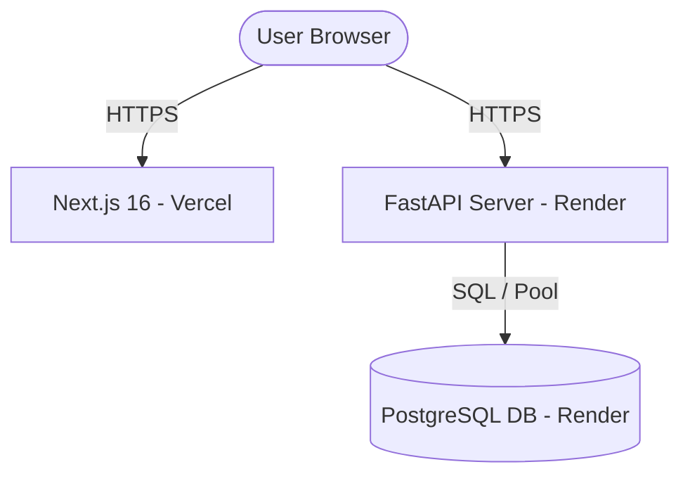

# FinSense AI – Production Deployment Guide

This guide outlines the step-by-step procedures to deploy the FinSense AI full-stack platform to production environments using **Vercel** for the frontend and **Render** for the backend + PostgreSQL database.

---

## Architecture Overview



---

## Phase 1: Database Setup (Render)

1. Sign in to your [Render Dashboard](https://dashboard.render.com).
2. Click **New** (top-right) and select **PostgreSQL**.
3. Configure the database details:
   - **Name**: `finsense-db-prod`
   - **Database Name**: `finsense_db`
   - **User**: `finsense_admin`
   - **Region**: Choose the region closest to your users.
   - **Plan**: Select **Free** (or Starter/Standard based on requirements).
4. Click **Create Database**.
5. Once active, note down the **Internal Database URL** (used for services on Render) and **External Database URL** (used to run migrations from your local system).

---

## Phase 2: Backend Deployment (Render)

1. Click **New** (top-right) and select **Web Service**.
2. Connect your Git repository.
3. Configure the Web Service settings:
   - **Name**: `finsense-api`
   - **Language**: `Python`
   - **Region**: Choose the same region as the database.
   - **Branch**: `main`
   - **Root Directory**: `backend` (or leave empty and set Build Command below).
   - **Build Command**: `pip install -r requirements.txt`
   - **Start Command**: `uvicorn app.main:app --host 0.0.0.0 --port 10000`
4. Add the following **Environment Variables** in the configuration page:
   - `ENV`: `production`
   - `DATABASE_URL`: *Your Internal Database URL* (from Phase 1)
   - `JWT_SECRET`: *A secure random string (minimum 32 characters)*
   - `CORS_ORIGINS`: `https://your-frontend.vercel.app` *(Replace with your actual Vercel domain once created)*
   - `FRONTEND_URL`: `https://your-frontend.vercel.app`
   - `OPENAI_API_KEY`: *Your OpenAI API key (optional fallback is the local rules-based analyst)*
5. Click **Create Web Service**. 
6. Once the service deploys, copy the service domain URL (e.g. `https://finsense-api.onrender.com`).

### Running Migrations in Production
Before the backend can successfully interact with your production database, you must run the database schema migrations.
From your local terminal (configured with python virtual environment inside `backend/`):
```bash
# In your local backend/ directory:
# Temporarily set the DATABASE_URL environment variable to the External Database URL:
$env:DATABASE_URL="your-external-postgresql-database-url"  # Windows PowerShell
# or export DATABASE_URL="your-external-postgresql-database-url" # macOS/Linux

# Execute the migrations to bootstrap tables:
python -m alembic upgrade head
```

---

## Phase 3: Frontend Deployment (Vercel)

1. Sign in to your [Vercel Dashboard](https://vercel.com).
2. Click **Add New** and select **Project**.
3. Import your Git repository.
4. Configure the project settings:
   - **Framework Preset**: `Next.js`
   - **Root Directory**: `frontend`
5. Expand **Environment Variables** and add:
   - `NEXT_PUBLIC_API_URL`: `https://finsense-api.onrender.com/api` *(Your deployed Render backend API URL)*
6. Click **Deploy**.
7. Vercel will build and optimize the pages, generating a production domain URL (e.g. `https://finsense-ai.vercel.app`).
8. **CRITICAL STEP**: Copy this URL, return to your Render Backend settings, and update the `CORS_ORIGINS` and `FRONTEND_URL` environment variables with it to restrict unauthorized API access.
